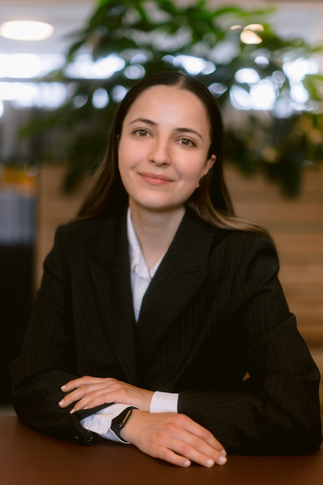

# Daria Zahaleanu

I am Daria. I write code and post about AI. 

<!--  -->

<!-- ## Highlights

### Recent Work & Interests

1. **[Recent Project/Publication](link-to-work)**: Brief description of your most important recent work or research
2. **[Blog](/blog/)**: Thoughts and insights on current topics in your field  
3. **[Research](/research/)**: Academic publications and ongoing research projects
4. **[Professional Services](link-to-consulting-or-services)**: How I contribute value to organizations and projects

 -->

## Brief Bio

I am a computer engineer with a passion for AI. Professional with a proven track record of transforming data into production‐ready platforms and a passion for AI systems. Researcher to leveraging AI and technical excellence for the greater good.

I hold a MSc. in Computer Science and a BSc in Computer Engineering. Check my CV in the section above.

---
 

*Last updated: {{ "now" | date: "%B %Y" }}*
